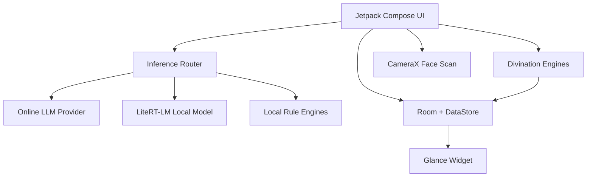

# CyberDiviner

CyberDiviner is an Android divination app that turns classical fortune-telling rituals into a polished mobile product. It combines I-Ching hexagrams, tarot spreads, face reading, almanac guidance, offline inference, and a local archive inside a restrained black-and-white interface with cinnabar red accents.

The project is built for users who want a playful but coherent divination experience, and for developers exploring how traditional symbolic systems can be shaped into modern on-device AI applications.

**Languages:** [English](README.md) | [中文](README.zh.md)

## Highlights

- **Oracle Chat**: ask natural-language questions and receive structured poetic readings.
- **I-Ching and Liuyao**: shake-to-cast hexagrams, changing lines, classical-style interpretation, and local rule support.
- **Cyber Tarot**: 78-card deck, multiple spreads, haptic card interaction, and consistent reading cards in the archive.
- **Face Reading**: camera-guided face alignment, facial feature extraction, and physiognomy-style interpretation.
- **Cyber Almanac**: daily auspicious guidance, energy level, colors, and a home-screen widget.
- **Digital Wooden Fish**: a simple merit-tapping interaction for daily retention.
- **Archive**: local reading history for oracle, I-Ching, tarot, and face readings.

## AI And Offline Strategy

CyberDiviner supports configurable inference modes:

| Mode | Behavior |
|:--|:--|
| Auto | Prefer online LLM when configured, then use the downloaded local model, then local rules as the final fallback. |
| Online only | Use the configured online provider. |
| Offline only | Use the downloaded on-device model. If the model cannot run, the app reports the failure instead of silently downgrading premium output. |

The offline path uses an on-device Gemma-class model through a LiteRT-LM bridge. Output is normalized per feature so future model changes do not break the product format. Local rule engines remain available for baseline utility and graceful degradation in non-premium paths.

## Product Surface

**Oracle Chat**

Produces a fixed three-part response: poetic sign text, interpretation, and final advice.

**I-Ching**

Builds hexagrams from simulated coin tosses and maps results to Yi Jing-style guidance.

**Tarot**

Supports single-card, three-card, Celtic Cross, horseshoe, and relationship spreads. Readings are normalized into a stable structure with a four-character fortune title and a concise one-line meaning.

**Face Reading**

Guides the user into the camera frame, waits for the user to start analysis, extracts face features locally, and generates a traditional physiognomy-style reading.

**Archive**

Stores reading summaries locally and keeps card previews consistent across all divination types.

## Architecture



## Tech Stack

| Area | Technology |
|:--|:--|
| Language | Kotlin |
| UI | Jetpack Compose, Material 3 |
| Architecture | Hilt, ViewModel, Kotlin coroutines |
| Storage | Room, DataStore |
| Camera | CameraX with on-device face landmark extraction |
| AI | Online LLM adapters, LiteRT-LM local inference, deterministic local rules |
| Widget | Jetpack Glance |
| Build | Android Gradle Plugin, Gradle Wrapper, JDK 17 |

## Build

Requirements:

- Android Studio Ladybug or later
- JDK 17
- Android SDK 35
- Android device or emulator running Android 8.0+

```bash
git clone https://github.com/sinonchum/CyberDiviner.git
cd CyberDiviner
./gradlew assembleDebug
```

Install a debug build:

```bash
adb install -t -r app/build/outputs/apk/debug/app-debug.apk
```

Build a release APK:

```bash
./gradlew assembleRelease
```

## Configuration

Open the in-app Config page to choose inference mode, configure an online provider, enable the local model, and manage the downloaded model file. The app is designed to keep output shape stable across providers, so online and offline readings remain visually consistent.

## Repository Layout

```text
app/src/main/java/com/cyberdiviner/
├── data/          Room entities, DAOs, remote LLM config, model types
├── engine/        Divination engines, fortune summaries, offline inference
├── ui/            Compose screens for each feature
├── widget/        Home-screen almanac widget
└── util/          Shared utilities
```

## License

MIT
