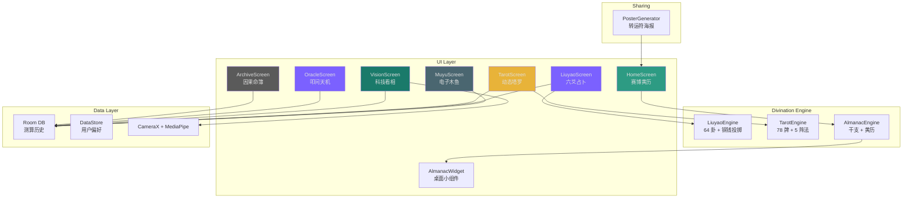

<div align="center">

# CyberDiviner: Cyberpunk Fortune-Telling for Android

**A cyberpunk-styled divination app that blends Chinese metaphysics with modern Android development. Almanac, I-Ching, Tarot, face reading, and more -- wrapped in neon aesthetics.**

[](LICENSE)
[]()
[](https://kotlinlang.org)
[]()

---

**[English](README.md)** | **[中文](README.zh.md)**

</div>

---

## What It Does

CyberDiviner is a fortune-telling app that takes ancient Chinese divination traditions and runs them through a cyberpunk filter. Dark backgrounds, neon accents, binary clocks, and procedurally generated interpretations -- all running entirely on your device.

### Core Features

**Oracle Chat (叩问天机)**
A roadside fortune teller chat experience. Ask questions in natural language and receive cryptic, stylized responses drawn from classical Chinese divination lore. The fortune teller has a personality -- part sage, part street poet.

**I-Ching Divination (周易六爻)**
Shake your phone 6 times to simulate three-coin tosses. The app builds a hexagram from your results and generates a reading that blends classical Yi Jing commentary with modern interpretation. Three persona modes available: the ancient sage, the quantum taoist, and the sarcastic bot.

**Cyber Tarot (赛博塔罗)**
78-card deck with multiple spread layouts. Choose from a single card draw, three-card past/present/future, or the full Celtic Cross. Card flips come with haptic feedback and neon-flavored animations.

**Face Reading (视界摸骨)**
Camera-based face scanning using on-device MediaPipe. No images leave your phone. The app tracks 478 facial landmarks, maps them to traditional physiognomy concepts, and generates a reading overlaid with a scan-line HUD.

**Digital Wooden Fish (电子木鱼)**
Tap to accumulate merit. Sometimes the simplest features get the most daily use.

**Archive (因果命簿)**
Your reading history, stored locally. Review past divinations, track patterns, and revisit previous fortune teller conversations.

**Desktop Widget (桌面小插件)**
A home screen widget that displays your daily almanac -- day energy level, auspicious/inauspicious activities, and lucky colors at a glance.

### Additional Features

- **Fortune Poster Generator** -- One-tap shareable cyberpunk posters with your reading results
- **Offline Core** -- I-Ching engine and almanac calculations run entirely on-device

---

## Architecture



### Tech Stack

| Layer | Technology |
|:------|:-----------|
| UI | Jetpack Compose 1.8, Material 3, Custom shaders |
| DI | Hilt |
| Database | Room + DataStore |
| Camera | CameraX + MediaPipe Face Landmarker |
| Widget | Jetpack Glance |
| Build | Kotlin 2.0, AGP 8.7.3, Java 17 |

---

## Getting Started

### Prerequisites

- Android Studio Ladybug or later
- JDK 17
- Android SDK 35
- A physical Android device (minSdk 26)

### Build

```bash
git clone https://github.com/sinonchum/CyberDiviner.git
cd CyberDiviner
./gradlew assembleDebug
```

### Install

```bash
adb install -t -r app/build/outputs/apk/debug/app-debug.apk
```

---

## Design Language

The visual identity draws from acid graphics and cyberpunk terminal aesthetics:

- **Palette**: Neon cyan (#00FFCC), magenta (#FF00FF), green (#39FF14) on near-black (#0A0A0F)
- **Typography**: Monospace throughout, binary-formatted dates
- **Motion**: Animated sweep gradients, spring-physics coin tosses, card flip animations
- **Haptics**: Linear motor feedback on coin landings and card interactions

---

## Project Structure

```
app/src/main/java/com/cyberdiviner/
├── ui/
│   ├── theme/          # Color, Typography, AcidDesign
│   ├── home/           # Cyber Almanac dashboard
│   ├── oracle/         # Oracle Chat (叩问天机)
│   ├── liuyao/         # I-Ching divination + coin animation
│   ├── tarot/          # Tarot card spreads
│   ├── vision/         # Face scanning + scan-line HUD
│   ├── muyu/           # Digital wooden fish
│   ├── archive/        # Reading history (因果命簿)
│   └── shared/         # HapticUtils, BinaryClock, PosterGenerator
├── data/
│   ├── local/          # Room DB, DAOs, DataStore
│   └── model/          # Data classes
├── engine/             # LiuyaoEngine, TarotEngine, AlmanacEngine
└── widget/             # Glance desktop widget
```

---

## Development

This project was built using the [Autonomous AI Development Framework](https://github.com/sinonchum/autonomous-ai-framework) at L4 autonomy level. 52 Kotlin files, ~11K lines of code, developed across 4 phases with parallel subagent execution.

| Phase | Scope | Subagents |
|:------|:------|:----------|
| Phase 1 | Project skeleton + Data layer + Core UI | 9 parallel |
| Phase 2 | Haptic feedback + Tarot system | 3 parallel |
| Phase 3 | CameraX + MediaPipe face scanning | 2 parallel |
| Phase 4 | Poster generator + Desktop widget | 2 parallel |

**Total wall-clock time: 49 minutes** (12:50 AM to 01:39 AM). From empty directory to installed APK on a Xiaomi 12 Pro. Zero human intervention during autonomous execution.

---

## License

MIT

---

<div align="center">

[](https://github.com/sinonchum)

</div>
