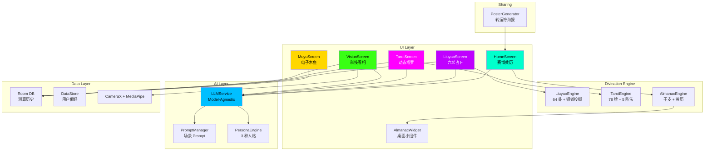

<div align="center">

# 🔮 CyberDiviner

### AI-Powered Cyberpunk Fortune-Telling for Android

**A cyberpunk-styled divination app that blends Chinese metaphysics with modern AI. Almanac, I-Ching, Tarot, face reading, and more, wrapped in neon aesthetics.**

[](LICENSE)
[]()
[](https://kotlinlang.org)
[]()

---

**[English](README.md)** | **[中文](README.zh.md)**

</div>

---

## What It Does

CyberDiviner is a fortune-telling app that takes the ancient Chinese divination traditions and runs them through a cyberpunk filter. Dark backgrounds, neon accents, binary clocks, and AI-generated interpretations.

### Core Features

**赛博黄历 (Cyber Almanac)**
Daily readings based on the traditional Chinese calendar system (Ganzhi). Displays your day's energy level, auspicious/inauspicious activities, lucky colors, and a cyber-themed AI wisdom quote. A desktop widget keeps this info one glance away.

**六爻占卜 (I-Ching Divination)**
Shake your phone 6 times. The app simulates three-coin tosses, builds a hexagram, and feeds it to an AI that speaks in both classical Yi Jing and modern slang. Three persona modes: the ancient sage, the quantum taoist, and the sarcastic bot.

**动态塔罗 (Cyber Tarot)**
78-card deck with AI-recommended spreads. The app analyzes your question's complexity and suggests the right layout, from a single card to the Celtic Cross. Card flips come with haptic feedback.

**科技看相 (AR Face Reading)**
Camera-based face scanning using on-device MediaPipe. No images leave your phone. The app tracks 478 facial landmarks, maps them to physiognomy concepts, and generates a reading overlaid with a scan-line HUD.

**电子木鱼 (Digital Wooden Fish)**
Tap to accumulate merit. That's it. Sometimes the simplest features get the most daily use.

### Bonus Features

- **Fortune Poster Generator** -- One-tap shareable cyberpunk posters with your reading results
- **Three AI Personas** -- Ancient Sage, Quantum Taoist, Sarcasm Bot
- **Model-Agnostic Backend** -- Works with OpenAI, Anthropic, Ollama, or any OpenAI-compatible API
- **Offline Core** -- I-Ching engine and almanac calculations run entirely on-device

---

## Architecture



### Tech Stack

| Layer | Technology |
|:------|:-----------|
| UI | Jetpack Compose 1.8, Material 3, Custom shaders |
| DI | Hilt |
| Database | Room + DataStore |
| Network | OkHttp + kotlinx.serialization |
| Camera | CameraX + MediaPipe Face Landmarker |
| Widget | Jetpack Glance |
| Build | Kotlin 2.0, AGP 8.7.3, Java 17 |

---

## Getting Started

### Prerequisites

- Android Studio Ladybug or later
- JDK 17
- Android SDK 35
- A physical Android device (minSdk 26)

### Build

```bash
git clone https://github.com/sinonchum/CyberDiviner.git
cd CyberDiviner
./gradlew assembleDebug
```

### Install

```bash
adb install -t -r app/build/outputs/apk/debug/app-debug.apk
```

### Configure AI (Optional)

The app works offline for I-Ching and almanac. For AI-powered interpretations, set your API key in the app settings or via environment variables.

---

## Design Language

The visual identity draws from acid graphics and cyberpunk terminal aesthetics:

- **Palette**: Neon cyan (#00FFCC), magenta (#FF00FF), green (#39FF14) on near-black (#0A0A0F)
- **Typography**: Monospace throughout, binary-formatted dates
- **Motion**: Animated sweep gradients, spring-physics coin tosses, card flip animations
- **Haptics**: Linear motor feedback on coin landings and card interactions

---

## Project Structure

```
app/src/main/java/com/cyberdiviner/
├── ui/
│   ├── theme/          # Color, Typography, AcidDesign
│   ├── home/           # Cyber Almanac dashboard
│   ├── liuyao/         # I-Ching divination + coin animation
│   ├── tarot/          # Tarot card spreads
│   ├── vision/         # AR face scanning
│   ├── muyu/           # Digital wooden fish
│   └── shared/         # HapticUtils, BinaryClock, PosterGenerator
├── data/
│   ├── local/          # Room DB, DAOs, DataStore
│   ├── remote/         # LLM service, Prompt manager
│   └── model/          # Data classes
├── engine/             # LiuyaoEngine, TarotEngine, AlmanacEngine
└── widget/             # Glance desktop widget
```

---

## Development

This project was built using the [Autonomous AI Development Framework](https://github.com/sinonchum/autonomous-ai-framework) at L4 autonomy level. 52 Kotlin files, ~11K lines of code, developed across 4 phases with parallel subagent execution.

| Phase | Scope | Subagents |
|:------|:------|:----------|
| Phase 1 | Project skeleton + Data layer + Core UI | 9 parallel |
| Phase 2 | Haptic feedback + Tarot system | 3 parallel |
| Phase 3 | CameraX + MediaPipe face scanning | 2 parallel |
| Phase 4 | Poster generator + Desktop widget | 2 parallel |

**Total wall-clock time: 49 minutes** (12:50 AM to 01:39 AM). From empty directory to installed APK on a Xiaomi 12 Pro. Zero human intervention during autonomous execution.

---

## License

MIT

---

<div align="center">

**Quality comes from the system, not the model.**

[](https://github.com/sinonchum)

</div>
