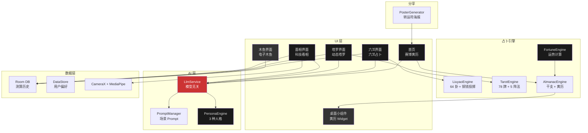

<div align="center">

# 🔮 CyberDiviner · 赛博算命

### AI 驱动的赛博朋克玄学引擎

**将中国传统玄学与 AI 结合的占卜应用。赛博黄历、六爻起卦、动态塔罗、科技看相，搭配 Bridgewater 黑白设计与朱砂红点缀。**

[](LICENSE)
[]()
[](https://kotlinlang.org)
[]()

---

**[English](README.md)** | **[中文](README.zh.md)**

</div>

---

## 功能

**赛博黄历**
基于中国传统干支纪时的每日运势。日柱能量等级、宜忌活动、幸运色彩、赛博风格的 AI 哲理金句。支持桌面小组件，一眼就能看到今日运势。

**六爻占卜**
摇一摇手机，模拟三枚铜钱六次掷卦。完整六十四卦库，本卦变卦自动演算。三种人格模型：古道仙风、量子道士、毒舌程序。

**动态塔罗**
78 张卡牌，AI 根据问题复杂程度自动推荐牌阵。从单牌到凯尔特十字，手指划卡触发线性马达震感。

**科技看相**
基于 MediaPipe 的面部扫描。478 个关键点追踪，完全端侧计算，原图不上传。扫描界面模拟经络线扫描动画，输出十二宫位分析。

**电子木鱼**
点击积累功德值。最简单的交互，最高的日活。

### 附加功能

- **转运符海报** — 一键生成赛博朋克风格分享图
- **三种 AI 人格** — 匹配不同场景的角色语调
- **模型无关后端** — 支持 OpenAI、Anthropic、Ollama 或任意兼容接口
- **离线核心** — 六爻算法和黄历计算完全本地运行，无需联网

---

## 技术架构



### 技术选型

| 层级 | 技术 |
|:------|:------|
| UI | Jetpack Compose 1.8, Material 3, 自定义 Shader |
| 依赖注入 | Hilt |
| 数据库 | Room + DataStore |
| 网络 | OkHttp + kotlinx.serialization |
| 相机 | CameraX + MediaPipe Face Landmarker |
| 小组件 | Jetpack Glance |
| 构建 | Kotlin 2.0, AGP 8.7.3, Java 17 |

---

## 快速开始

### 环境要求

- Android Studio Ladybug 以上
- JDK 17
- Android SDK 35
- 安卓真机 (minSdk 26)

### 构建

```bash
git clone https://github.com/sinonchum/CyberDiviner.git
cd CyberDiviner
./gradlew assembleDebug
```

### 安装

```bash
adb install -t -r app/build/outputs/apk/debug/app-debug.apk
```

### AI 配置（可选）

六爻起卦和黄历计算无需联网。如需 AI 解读，在应用内设置或环境变量中配置 API Key。

---

## 设计语言

视觉风格遵循 Bridgewater B&W 设计体系：

- **色板**: 黑白基调 + 朱砂红 (#CC3333) 点缀，深色底 (#0A0A0F)
- **字体**: 汇明朝体（标题）/ 霞鹜文楷（正文）/ JetBrains Mono（数据）
- **动效**: 基于弹簧物理的铜钱落地、卡牌翻转动画、细腻过渡
- **触感**: 线性马达在铜钱落地和卡牌交互时触发

---

## 开发数据

本项目基于 [Autonomous AI Development Framework](https://github.com/sinonchum/autonomous-ai-framework) 框架，以 L4 自主等级开发。共产生 52 个 Kotlin 文件、约 11,000 行代码，分 4 个阶段、16 个并行子 Agent 完成。

| 阶段 | 范围 | 子 Agent |
|:------|:------|:----------|
| Phase 1 | 项目骨架 + 数据层 + 核心 UI | 9 并行 |
| Phase 2 | 触感反馈 + 塔罗系统 | 3 并行 |
| Phase 3 | CameraX + MediaPipe 面部扫描 | 2 并行 |
| Phase 4 | 海报生成 + 桌面小组件 | 2 并行 |

**总挂钟时间：49 分钟**（00:50 到 01:39）。从空目录到安装 APK 在小米 12 Pro 上运行。自主执行期间零人工干预。

---

## 项目结构

```
app/src/main/java/com/cyberdiviner/
├── ui/
│   ├── theme/          # Bridgewater B&W、AccentRed、字体
│   ├── home/           # 赛博黄历仪表盘
│   ├── liuyao/         # 六爻占卜 + 铜钱动画
│   ├── tarot/          # 塔罗牌阵
│   ├── vision/         # AR 面部扫描
│   ├── muyu/           # 电子木鱼
│   └── shared/         # 触感工具、二进制时钟、海报生成
├── data/
│   ├── local/          # Room 数据库、DAOs、DataStore
│   ├── remote/         # LLM 服务、Prompt 管理器
│   └── model/          # 数据模型
├── engine/             # 六爻引擎、塔罗引擎、黄历引擎
└── widget/             # Glance 桌面小组件
```

---

## License

MIT

---

<div align="center">

**质量来自系统，而非模型。**

[](https://github.com/sinonchum)

</div>
