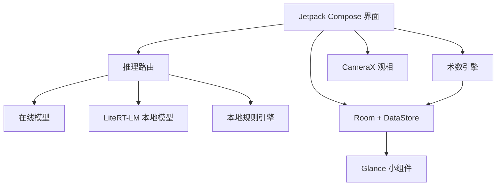

# CyberDiviner

CyberDiviner 是一款 Android 端占卜应用，把周易六爻、塔罗牌阵、面相解读、黄历宜忌、离线推理和本地命簿整合到一个克制、干净、带朱砂红点缀的黑白界面中。

它面向两类人：一类是希望获得有仪式感、有趣味、但输出稳定的占卜体验的用户；另一类是关注传统符号系统如何与端侧 AI、移动交互和商业产品结合的开发者。

**语言:** [English](README.md) | [中文](README.zh.md)

## 核心能力

- **叩问天机**：自然语言提问，输出固定结构的签文、解析和断语。
- **周易六爻**：摇动手机起卦，自动生成本卦、变卦和动爻解读。
- **赛博塔罗**：78 张塔罗牌，多种牌阵，翻牌动效与震感反馈。
- **视界摸骨**：相机引导入框，端侧提取面部特征，生成古风面相批语。
- **赛博黄历**：每日宜忌、能量值、幸运色与桌面小组件。
- **电子木鱼**：轻量点击交互，适合高频日常使用。
- **因果命簿**：本地保存签文、卦象、塔罗和面相记录。

## AI 与离线策略

CyberDiviner 支持三种推理模式：

| 模式 | 行为 |
|:--|:--|
| 自动 | 优先使用已配置的在线模型；在线不可用时使用已下载的本地模型；两者都不可用时才进入本地规则。 |
| 仅在线 | 只使用配置页指定的在线模型。 |
| 仅离线 | 只使用已下载的端侧模型；如果模型无法运行，应用会明确提示失败，不会静默降级成普通规则输出。 |

离线路径通过 LiteRT-LM bridge 调用 Gemma 级别端侧模型。每个功能都有输出规整层，用来限制格式漂移、提示词回声、英文混入和重复文本。基础规则引擎仍保留，用于非高级路径和兜底场景。

## 产品模块

**叩问天机**

固定输出「载入签文」「逻辑解析」「最终断语」，适合快速问事。

**周易六爻**

从铜钱爻象生成六十四卦推演，兼顾传统语感和现代解释。

**赛博塔罗**

支持单牌、三牌、凯尔特十字、马蹄和关系牌阵。每次解读包含四字批命、一句话命意和结构化牌阵解析。

**视界摸骨**

进入界面即开启相机，用户调整角度后手动开始分析。面部特征在端侧处理，并转写为传统面相风格的批语。

**因果命簿**

本地保存历史记录，并让塔罗、六爻、面相卡片遵循一致的标题与摘要逻辑。

## 架构



## 技术栈

| 领域 | 技术 |
|:--|:--|
| 语言 | Kotlin |
| 界面 | Jetpack Compose, Material 3 |
| 架构 | Hilt, ViewModel, Kotlin coroutines |
| 存储 | Room, DataStore |
| 相机 | CameraX 与端侧面部特征提取 |
| AI | 在线模型适配、LiteRT-LM 本地推理、本地规则引擎 |
| 小组件 | Jetpack Glance |
| 构建 | Android Gradle Plugin, Gradle Wrapper, JDK 17 |

## 构建

环境要求：

- Android Studio Ladybug 或更高版本
- JDK 17
- Android SDK 35
- Android 8.0 及以上真机或模拟器

```bash
git clone https://github.com/sinonchum/CyberDiviner.git
cd CyberDiviner
./gradlew assembleDebug
```

安装调试包：

```bash
adb install -t -r app/build/outputs/apk/debug/app-debug.apk
```

构建 release 包：

```bash
./gradlew assembleRelease
```

## 配置

在应用内 Config 页面选择推理模式、配置在线模型、启用本地模型并管理模型文件。应用会尽量保持不同模型之间的输出结构一致，让在线和离线结果在界面上呈现同一套产品规格。

## 目录结构

```text
app/src/main/java/com/cyberdiviner/
├── data/          Room 实体、DAO、远程模型配置、数据类型
├── engine/        术数引擎、四字批命、离线推理
├── ui/            各功能 Compose 页面
├── widget/        黄历桌面小组件
└── util/          通用工具
```

## License

MIT
